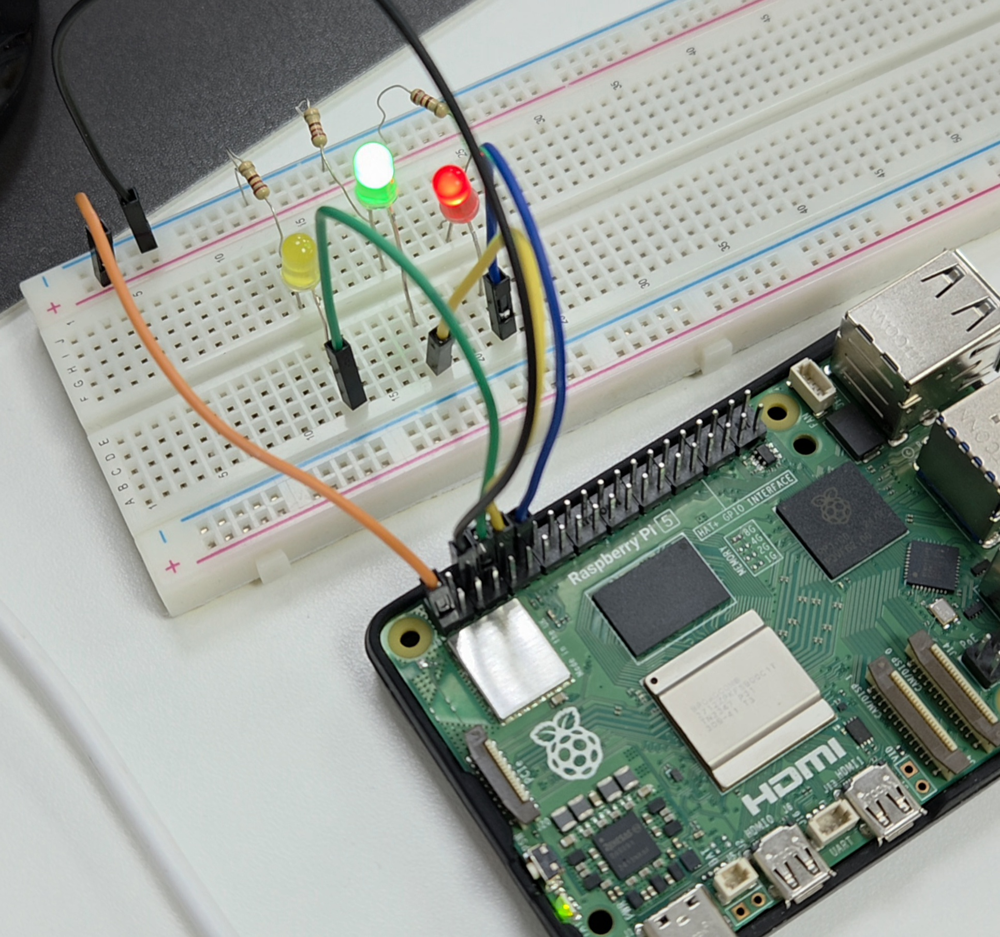
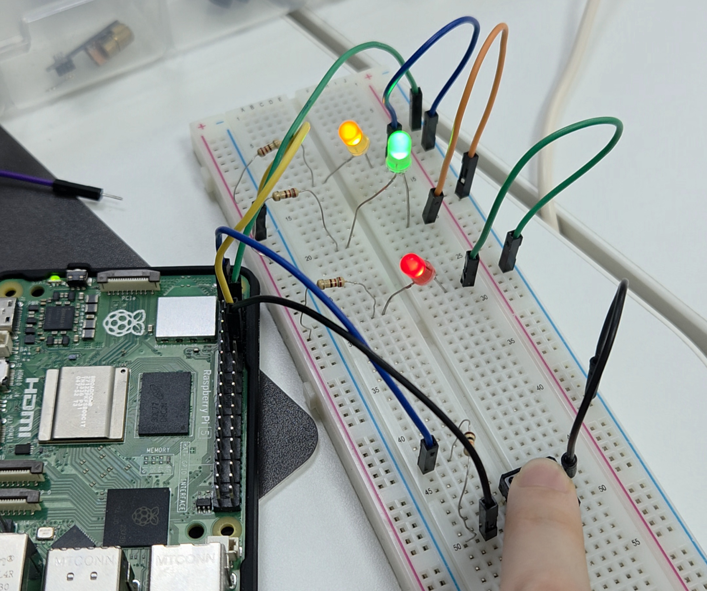

## LED 제어와 풀업회로 


### [Pull-Up 회로]
입력 핀의 전기적 상태가 떠 있는(floating) 것을 방지하기 위해,  
해당 핀을 기본적으로 HIGH(1) 상태로 만들어주는 회로

✔️ 입력 핀은 항상 0 또는 1이어야 하는데, 아무 것도 연결되지 않으면 값이 불안정(floating)해져서 노이즈·오작동 발생  
✔️ 버튼을 눌렀을 때 VCC가 GND와 직접 연결되면 쇼트(short)가 일어날 수 있음  

```
VCC
 |
[ Pull-up Resistor ]
 |  
INPUT PIN --------- (Switch) -------- GND
```
✔️ 버튼 안 눌림 → INPUT = HIGH  
✔️ 버튼 눌림 → INPUT = LOW  


---
### [Test 1]
H/W: LED 3개, 220옴 저항 3개  

LED 3개를 0.5초 간격으로 깜빡인다.  


---
### [Test 2]
HW: LED 3개, 220옴 저항 3개  

만약 on 상태라면 off로, off 상태라면 on으로 변경  
✔️ 1 입력시: 1번LED ON 또는OFF  
✔️ 2 입력시: 2번LED ON 또는OFF  
✔️ 3 입력시: 3번LED ON 또는 OFF  
✔️ 그외숫자입력시: 종료  




---
### [Test 3]
HW: LED 1개, 220옴 저항 1개  

만약 on 상태라면 off로, off 상태라면 on으로 변경  
✔️ 기능1 : 1을 입력받으면, 밝기가10% 씩밝아진다.  
✔️ 기능2 : 2를 입력받으면, 밝기가10%씩어두워진다  

최대밝기는100%, 최소밝기는0% 이다.


---
### [Test 4]
HW: LED 3개, 220옴 저항 3개, 버튼 1개, 10k옴 저항1개  

✔️ 풀업회로구성  
✔️ 기능1 : 버튼1 누르고있으면, LED 3개 한번에켜진다.  
✔️ 기능2 : 버튼1 떼면, LED 모두 꺼진다.  




---
### [Test 5]
HW: LED 1개, 220옴 저항 1개, 버튼 2개, 10k옴 저항 2개 

✔️ 풀업회로구성  
✔️ 기능1 : 버튼1 누르면, 밝기가점점올라가기(최대90 %)  
✔️ 기능2 : 버튼2 누르면, 밝기가점점낮아지기(최소10 %)


---
### [Test 6]
크리스마스 트리 만들기

HW: LED 5개, 220옴 저항 5개, 버튼 1개, 10k옴 저항1개

✔️ 기능: 버튼을누를때마다Mode 변경 
✔️ Mode 1  : LED 짝수번째, 홀수번째 번갈아가며 깜빡임  
✔️ Mode 2 : LED 전체 깜빡임


---
### Polling vs Interrupt 차이
- Polling 방식  
•	while True 루프 안에서 계속해서 버튼 상태를 체크(polling)  
•	CPU가 계속 바쁘게 돌면서 버튼 상태를 확인함 -> CPU자원을 많이 씀  
•	버튼을 누르는지 안 누르는지 계속 반복적으로 검사 -> 다른 이벤트를 놓칠 수 있음  
<br>
- Interrupt 방식  
•	while True 루프가 필요 없음  
•	CPU를 거의 사용하지 않음  
•	즉각적인 반응  
•	다른 작업과 동시에 수행하기 좋음  
•	gpiozero에서 가장 권장하는 방식  
<br>
- pause()  
프로그램이 종료되지 않도록  
이벤트가 발생하기를 기다리는 상를 유지해주는 함수  
<br>
test 6의 코드도 blink를 쓰면 내부적으로 쓰레드처럼 동작한다  

```
def press():
    global mode
    mode = 1 - mode
    print("Mode:", mode)

    if mode == 0:
        ledR.blink(0.5, 0.5)
        ledG.blink(0.5, 0.5, delay=0.5)
    else:
        ledR.blink(0.5, 0.5)
        ledG.blink(0.5, 0.5)

btn.when_pressed = press

pause()
```