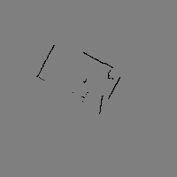
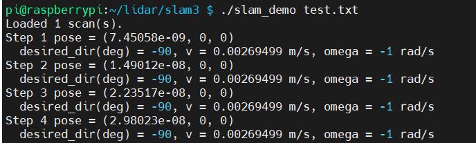
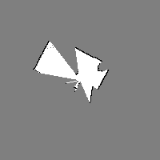

# LiDAR

## txt 파일로 map 그리기

C++로 OpenCV 이용

### OpenCV 설치
```
sudo apt-get update
sudo apt-get install libopencv-dev
```

### C++ build
```
g++ lidar_map.cpp -o lidar_map `pkg-config --cflags --libs opencv4`
```

### 생성된 이미지 확인
  


## SLAM LiDAR
로봇의 현재 위치와 방향을 추적하는 SLAM 알고리즘 적용  

### C++ build
```
g++ -std=c++17 main.cpp slam.cpp -o slam_demo `pkg-config --cflags --libs opencv4`
```

### 실행
```
./lidar_slam test.txt
```

### 생성된 이미지 확인
  
  

현재는 한번의 라이더 output txt파일만을 이용하고 있기에 pos값과 이동 방향에 변화가 거의 없음을 확인할 수 있다.  


<br>

