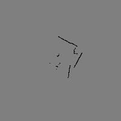

# LiDAR

## txt 파일로 map 그리기

C++로 OpenCV 이용

### OpenCV 설치
```
sudo apt-get update
sudo apt-get install libopencv-dev
```

### C++ build
```
g++ lidar_map.cpp -o lidar_map `pkg-config --cflags --libs opencv4`
```

### 생성된 이미지 확인
1) max_range_m = 4.0f;
2) max_range_m = 2.0f; - 2m까지만 사용  

  
  

