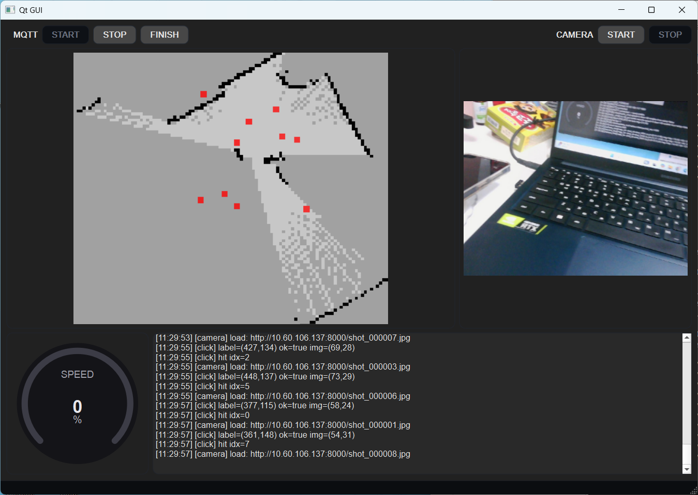

# Qt

MQTT로 들어오는 **map_state / camera_shot / pose / motor_cmd**를 받아서  
- **맵 + 샷 마커 렌더링**
- **카메라 이미지 표시**
- **로그 출력/저장**
- **속도 게이지 표시**
를 하는 Qt Widgets 기반 GUI.

MQTT START를 누르면 MQTT 연결  
CAMERA START를 누르면 카메라 이미지 촬영 시작  

 

---

## 파일 의존성
- `mainwindow.*`  → Main Window
  - `mymqtt.*`, `workers.*`, `drawmap.*`, `drawcamera.*`, `gaugewidget.*`, `app_types.h`
- `mymqtt.*` → `app_types.h` (+ QtMqtt + Qt JSON)
- `workers.*` → `app_types.h` (+ QtNetwork + QThread 사용 전제)
- `drawmap.*` → `app_types.h` (+ QLabel/QPainter)
- `drawcamera.*` → QLabel에 QImage 표시만
- `gaugewidget.*` → 커스텀 게이지 위젯

---

## 파일별 역할 정리

### `app_types.h`
- MQTT(JSON) ↔ GUI 내부에서 공통으로 쓰는 데이터 타입 정의

---

### `mymqtt.h / mymqtt.cpp`
- `QMqttClient` 래핑: 브로커 연결/해제, 기본 토픽 구독
- 수신 메시지(JSON)를 파싱해서 **app_types 구조체로 emit**
- GUI에서 버튼 조작 시 motor/camera command publish 함수 제공

---

### `workers.h / workers.cpp`
- 로그 작성, motor 정보 표시, http 이미지 캐싱 등을 UI 스레드에서 분리하기 위한 Worker 묶음
- 구성
  - LogWorker
    - 로그 파일 열고 append/flush (UI 로그 + 파일 저장 분리)
  - MotorWorker
    - motor_cmd 수신 시 값 필터링/중복 방지 후 speedChanged/steerChanged emit
  - CameraWorker
    - 샷 썸네일/원본 이미지를 HTTP로 받아 캐싱/프리패치
    - 클릭된 shot을 실제 카메라 QLabel에 띄우기 위한 cameraReady(QImage) emit
  - MapRenderWorker
    - map_state 이미지(HTTP or local) 로딩 + shot 마커 + pose 등을 QImage로 렌더

---

### `drawmap.h / drawmap.cpp`
- QLabel 위에 “맵 이미지 + shot 마커 + (선택)pose”를 그리는 렌더러
- 클릭 히트테스트(마커 클릭 → 해당 Shot emit) 담당

---

### `drawcamera.h / drawcamera.cpp`
- 카메라 QLabel에 QImage를 세팅
- UI 의존을 최소화해서 표시의 역할만 수행

---

### `gaugewidget.h / gaugewidget.cpp`
- 속도/게이지 표시용 커스텀 위젯

---

### `mainwindow.h / mainwindow.cpp`
  - 앱 전체를 조립
  - UI 생성/초기화, MQTT 연결, Worker Thread 구성, signal/slot 연결
  - 버튼 핸들러에서 publish 호출 및 UI 상태 전환

---

### `mainwindow.ui`
- Qt Designer로 만든 UI 레이아웃/위젯 배치 정의

---

### `CMakeLists.txt`
- Qt 프로젝트 빌드 설정 (Qt6 컴포넌트 링크, 소스 등록)

