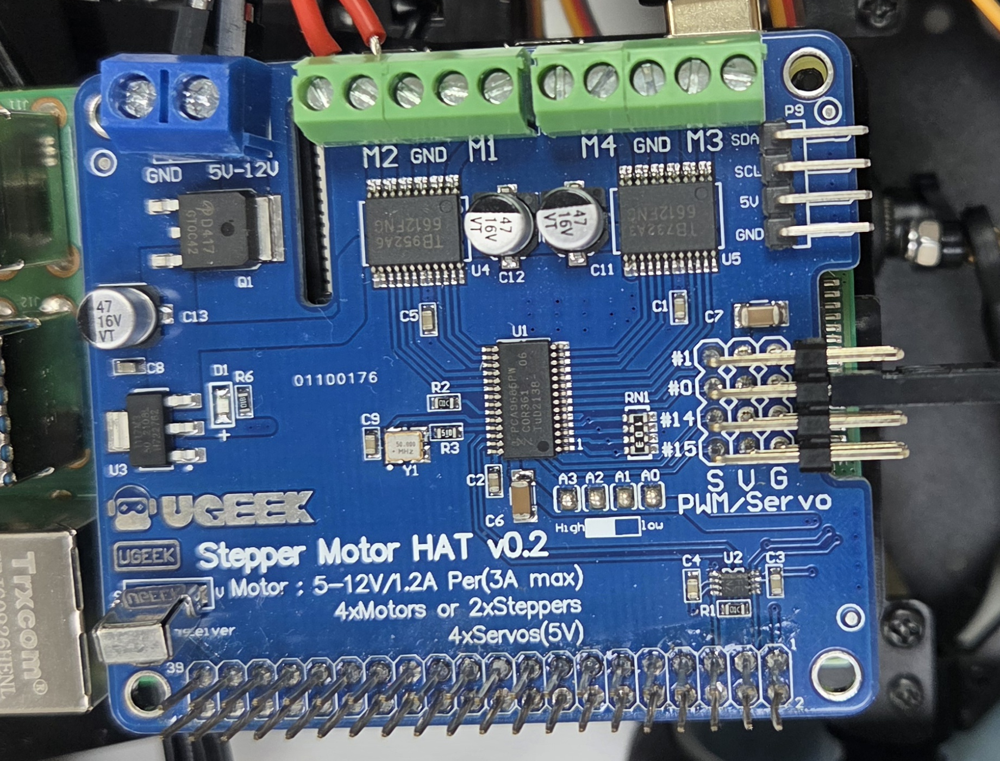
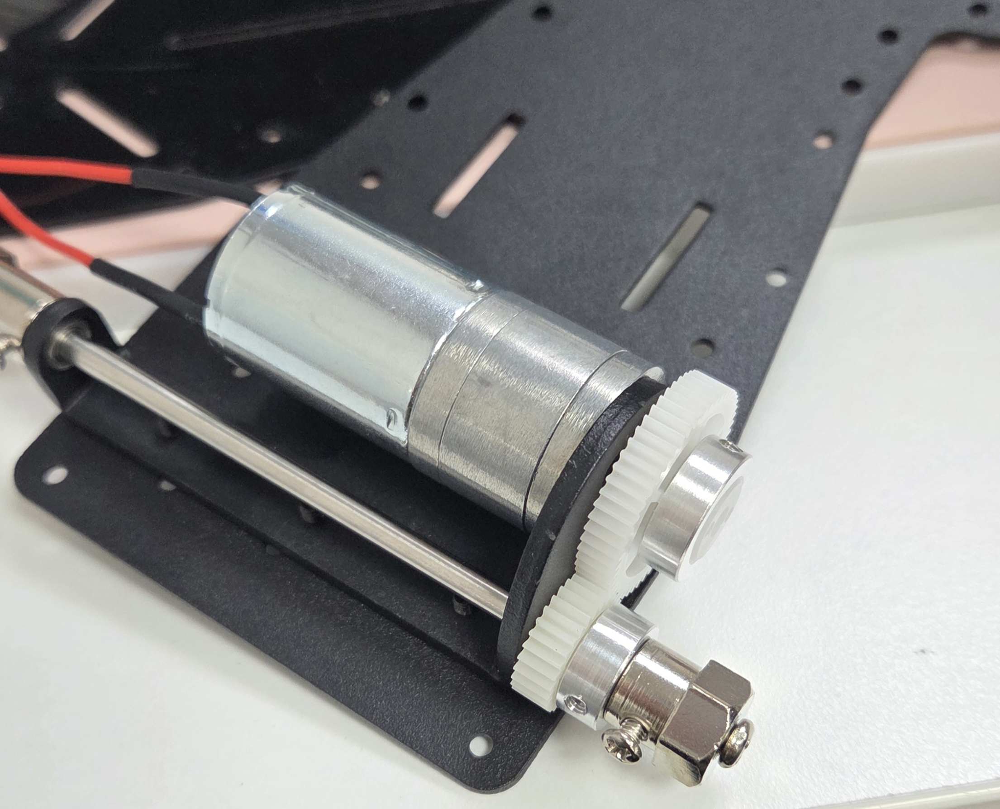

# RC car

## Raspberry pi 4

## MotorHAT module

## RC car 조립
뒷바퀴  
  
 
앞바퀴  
  
 
Raspberry 보드 위에 motorHAT 연결  
  

## Codes

### motor.py
기본적으로 dc motor를 작동시키는 코드  

### servo.py
서보모터로 RC car의 방향전환을 가능하게 구현  
- Left: 200
- Middle: 350
- Right: 500

### move.py
사용자의 입력에 따라 전진, 후진, 정지, 좌회전, 우회전, 중앙이 가능하도록 만든 쉘  

### ultrasonic.py
초음파 센서 이용  
물체가 10cm 이내에 존재 시 Stop  
