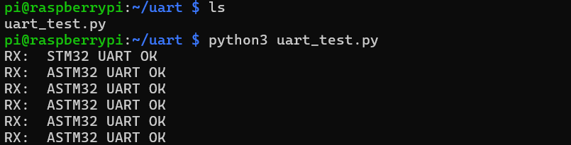
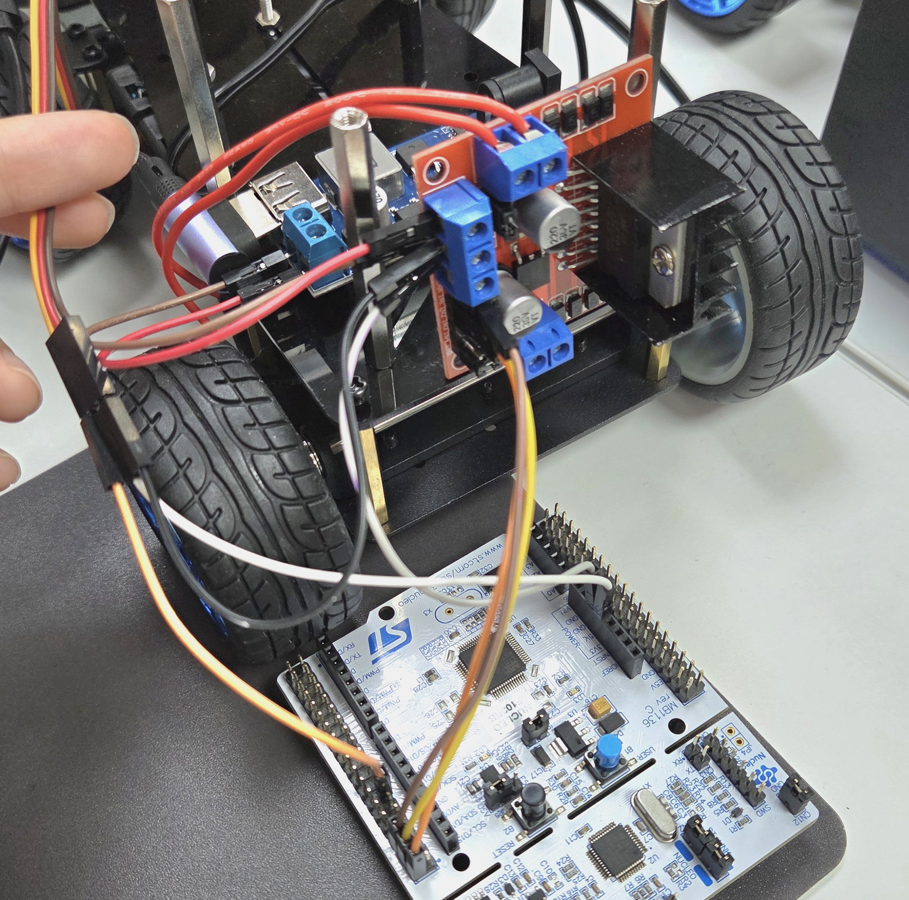

# STM 보드로 모터 구동하기

## 1. Usart Test
uart 통신 확인 코드 구현  
CubeIDE를 통해서 NUCLEO-F103RB에 업로드  
라즈베리파이와 연결 후  통신 확인  

 

## 2. DC Motor Test
NUCLEO-F103RB에 모터드라이버(L298N) 연결  
NUCLEO-F103RB의 PIN PC5, PC6, PC8 이용  

- L298N ENA - NUCLEO PC5
- L298N IN1 - NUCLEO PC6
- L298N IN2 - NUCLEO PC8
- L298N OUT1 - DC Motor
- L298N OUT2 - DC Motor
- L298N 12V - 전원
- L298N GND - 전원 GND
- L298N GND - NUCLEO GND

 

### L298N
모터가 채널 A를 사용하는 경우, 모터는 OUT1과 OUT2핀에 연결되어야 한다.  
모터를 켜려면 Enable A핀이 High 상태여야 하며,  
모터를 시계 방향으로 동작시키려면 IN1은 High 상태, IN2는 Low 상태여야 한다.  
모터를 반시계 방향으로 동작시키려면 IN1은 Low 상태, IN2는 High 상태여야 한다.  
[L298N 설명](https://www.teachmemicro.com/use-l298n-motor-driver/)

## 3. Servo Motor Test

### TIM3 설정
서보모터는 PWN 신호를 받는다.  
주기가 20mx(50Hz)일 때, 펄스 폭이 1ms면 0도, 1.5ms이면 90도, 2ms면 180도로 출력된다.  

서보는 매 20ms마다 들어오는 High 구간의 길이를 보고 각도를 정하는 것이다.  

정확한 펄스 길이를 만들기 위해서 MCU의 Timer를 이용하여 신호를 만든다.  

- 설정
  - Timers → TIM3  
  - Channel1 를 PWM Generation CH1 로 설정  
  - -> 자동으로 PA6 가 PWM 핀으로 잡힘  
Prescaler: 72-1 -> 72MHz / 72 = 1MHz (1us)  
Period: 20000-1 -> 1MHz 기준 20000us = 20ms

 

### 내 RC car 방향
- 0 = LEFT
- 75 = MIDDLE
- 150 = RIGHT

 