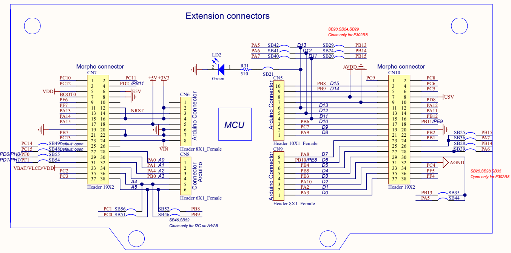
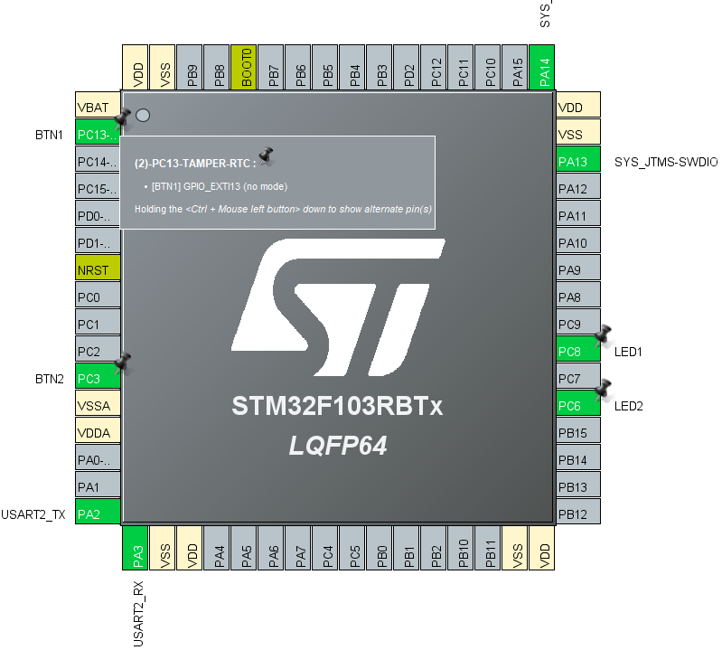
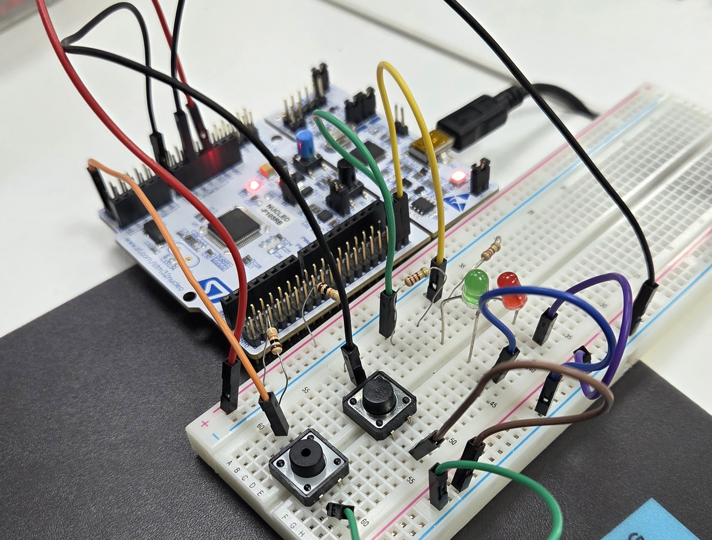
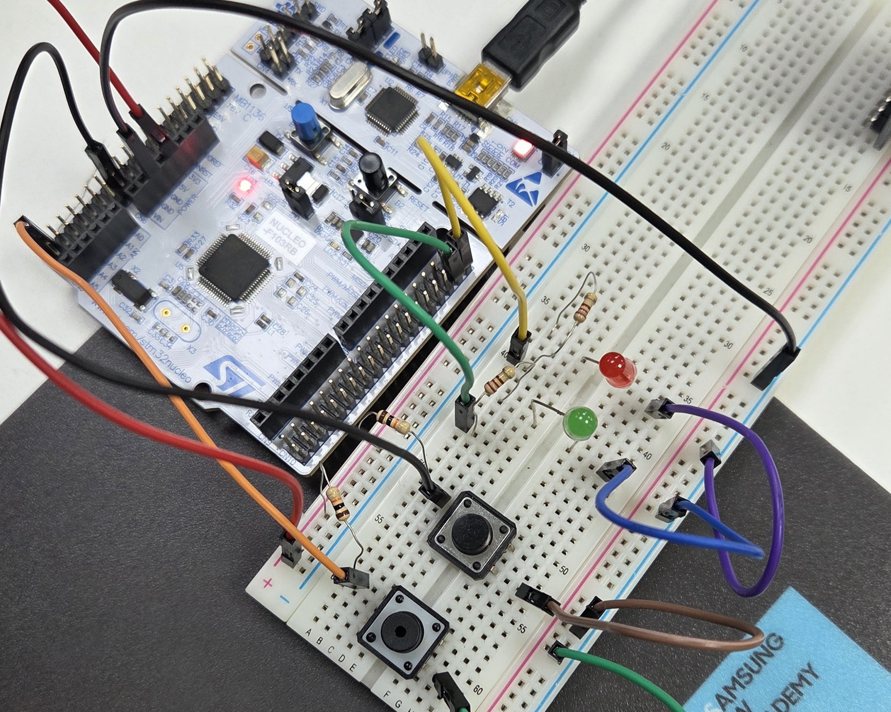
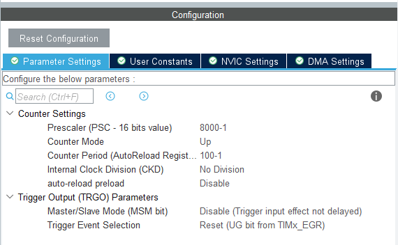
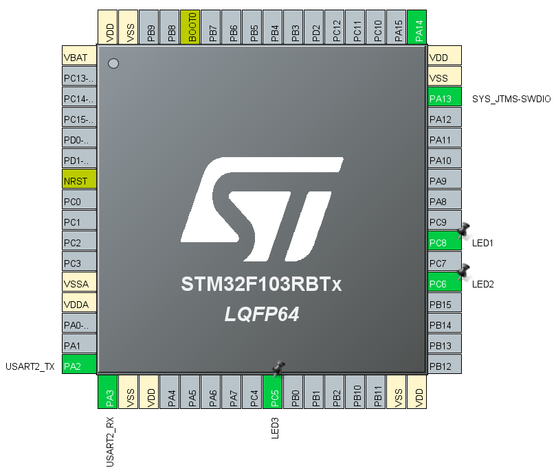

# Interrupt

## 1. 보드 정보
- **보드 이름**: Nucleo
- **보드 모델명**: Nucleo-F103RB
- **ST사의 CPU 칩셋 이름**: STM32F103RB
- **CPU 설계**: ARM Cortex-M3

  
  

## [Test 1]
Interrupt 우선순위 테스트  
 
Bread board에 버튼 2개와 LED 2개를 연결  
- 버튼1 누르면, LED1 무한 blink  
- 버튼2 누르면, LED2 무한 blink  

아래와 같은 우선 순위 상황을 만들고 테스트
1) 버튼1 > 버튼2  
2) 버튼1 < 버튼2  
3) 버튼1 == 버튼2  

  
  

## [Test 2]
타이머 LED   

LED 3개를 Bread board 에 연결  

- LED1 : 0.5s 에 한번 blink
- LED2 : 0.3s 에 한번 blink
- LED3 : 0.7s 에 한번 blink

  

STM32 보드의 기본 시스템 클럭(System Clock)은 8 MHz  
- Prescaler: 8000 - 1   
타이머 입력 클럭 = 8 MHz / (7999 + 1) = 1 kHz  
1ms마다 타이머가 1번씩 카운트가 증가  
- Counter Period: 100 - 1  
타이머가 100ms마다 1번씩 카운트를 증가하도록 Counter Period 조정  

  

LED 1, 2, 3을  PC8, PC6, PC5에 연결  
