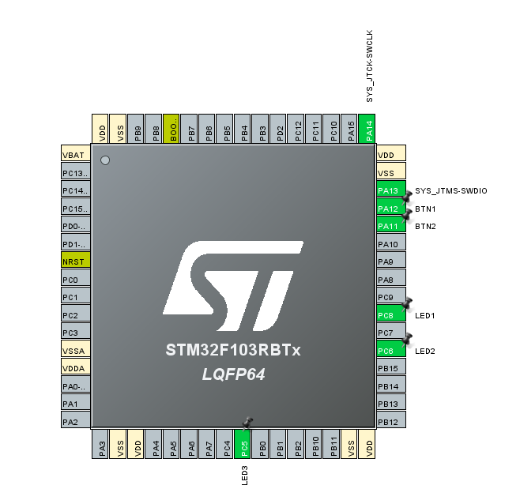
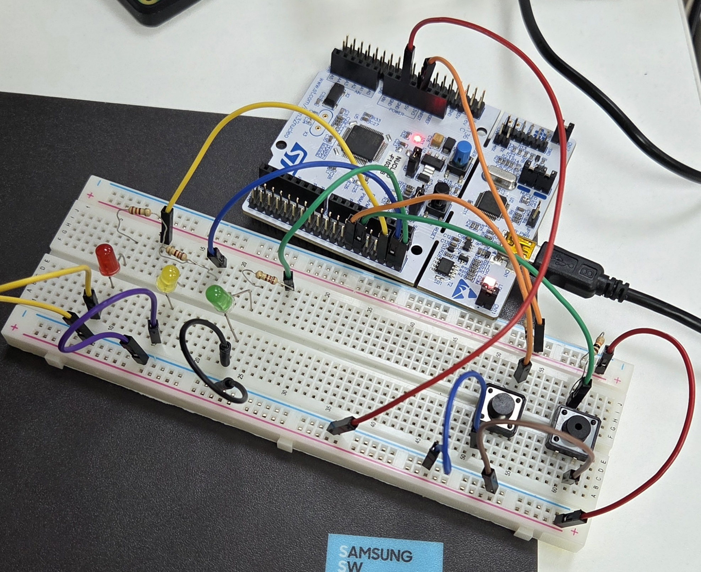

## LED & UART

## 1. 보드 정보
- **보드 이름**: Nucleo
- **보드 모델명**: Nucleo-F103RB
- **ST사의 CPU 칩셋 이름**: STM32F103RB
- **CPU 설계**: ARM Cortex-M3

  
  

### [Test 1]
LED 깜빡이기  
 
Bread Board에 LED 3개를 연결하여 **PWM**을 이용해 밝기 조절하기  
- 회로 연결:
    - 각 LED는 **220옴 저항**과 함께 연결되어야 합니다.
    - LED 1, 2, 3을 **동시에 깜빡이기**.
    - LED 1만 켜기 → LED 2만 켜기 → LED 3만 켜기 → LED 1만 켜기 (반복)  

### [Test 2]
STM32 Nucleo Board PWM Example  

Delay 함수를 이용하여 LED의 밝기를 조절하기
- 힌트:
    - 50ms 껐다가, 50ms 켰다를 빠르게 반복하면 LED가 어두워진다.
    - 70ms 껐다가, 30ms 켰다를 빠르게 반복하면 LED가 더 어두어진다.

### [Test 3_1]
Bread Board에 버튼 2개 연결하기  
버튼1 누르면 LED 3개 ON, 다시 누르면 LED 3개 OFF  

### [Test 3_2]
Bread Board에 버튼 2개 연결하기  
LED는 계속 깜빡인다.

- 버튼1 누르면 LED1 → LED2 → LED3 → LED1 → …  
- 버튼2 누르면 LED3 → LED2 → LED1 → LED3 → …  

