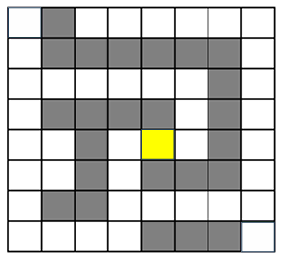
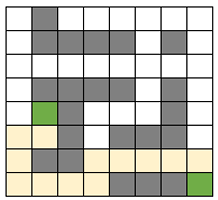

## IMU 기반 LED Pixel 이동

### [라즈베리파이 세부 사양]
Raspberry Pi 5 Model B (8GB RAM)
보드명: Raspberry Pi 5 Model B (8GB RAM)
칩셋: BCM2712 (Broadcom社)
CPU: 2.4GHz ARM Cortex-A76 쿼드코어
통신: Wi-Fi / BLE, Bluetooth 5.0 / Ethernet 등

### [Test 1]
IMU 센서를 이용하여 LED Pixel을 기울기에 따라 이동시키기
추가적으로 맵을 구성하여 벽을 통과하지 못하도록 구현

✔️ IMU 센서 기반 LED Pixel 이동
기울기(roll, pitch)를 읽어 LED 점을 이동
점 위치가 맵의 바깥으로 벗어나지 않도록 제한

✔️ 맵충돌 처리
LED 픽셀은 벽을 통과할 수 없음
기울여도 벽 방향일 경우 이동 불가

---
### [Test 2]
출발지점에서 도착지점까지의 모든 경로를 센스햇에 출력

✔️ 출발지/도착지 고정  
출발지점: (0, 0)  
도착지점: (7, 7)  

✔️ 고정된 맵(Hard-coded map)  
- 모든 학생 동일한 맵 사용  
- 벽은 지나갈 수 없음  
- 출발지(초록), 도착지(초록) 표시  

✔️ 버튼 클릭 시 다음 경로 출력  
- 버튼을 누를 때마다 한 개의 경로씩 순차적으로 표시
- 경로의 순서(1번 → 2번 → 3번 …)는 바뀌어도 상관 없음
- N번째 경로까지 출력 후 버튼을 다시 누르면 다시 1번 경로부터 반복 출력  

---
### [Test 3]
버튼 클릭 시 점을 이동시키고, 현재 위치에서 목표지점까지의 최단 경로를 실시간으로 출력

✔️ 실시간 최단 경로 계산  
- 점이 이동할 때마다  
- 현재 위치 → 도착지점까지의 **최단 경로(BFS)**를 센스햇에 시각화  
- 벽은 기존과 동일하게 통과 불가

